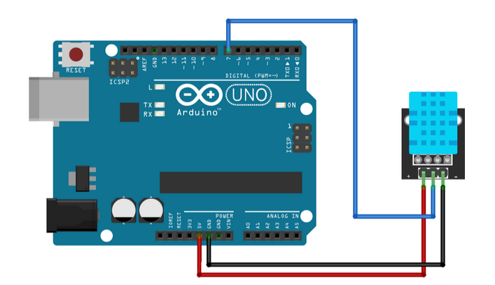
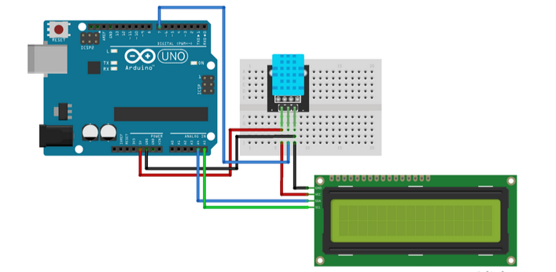

# MAfficher la température et l’humidité mesurées par le capteur DHT11 connecté à Arduino sur l’afficheur LCD I2C

## Auteur
Elkhoulati Yahya

## Aperçu du Projet

Ce projet est une démonstration simple mais efficace de la surveillance de la température et de l'humidité à l'aide d'un Arduino Uno et d'un capteur DHT11. Les données collectées sont affichées sur un écran LCD avec une interface i2C, rendant l'appareil autonome et facile à utiliser.

### Objectifs

- Mesurer la température et l'humidité en temps réel.
- Afficher les mesures sur un écran LCD pour un retour immédiat.
- Gérer les erreurs du capteur de manière gracieuse et garantir la fiabilité des données.

---

## Composants

- **Arduino Uno** : Microcontrôleur pour traiter les données du capteur et gérer les sorties.
- **Capteur DHT11** : Mesure la température et l'humidité.
- **Écran LCD 16x2 avec interface i2C** : Affiche les données en temps réel.
- **Autres Matériaux** : Breadboard, fils de connexion et source d'alimentation.

### Ajouts Optionnels

- **Module Wi-Fi ESP8266/ESP32** : Pour une fonctionnalité IoT.
- **Module de Carte SD** : Pour enregistrer les données sur le long terme.
- **Capteur Amélioré (DHT22)** : Pour une meilleure précision et une plage élargie.

---

## Schéma de Câblage

### 1. Connexion Directe



### 2. Avec Affichage LCD



---

## Aperçu du Code

Le code Arduino lit les données du capteur DHT11, gère les erreurs potentielles et affiche les données sur l'écran LCD.

### Fonctionnalités

- Lecture de la température et de l'humidité toutes les 10 secondes.
- Gestion des erreurs pour traiter les données invalides du capteur.
- Design modulaire et facilement extensible.

### Exemple de Code

```cpp
#include "DHT.h"
#define DHTPIN 2
#define DHTTYPE DHT11
DHT dht(DHTPIN, DHTTYPE);

void setup() {
  Serial.begin(9600);
  dht.begin();
}

void loop() {
  float temp = dht.readTemperature();
  float hum = dht.readHumidity();

  if (isnan(temp) || isnan(hum)) {
    Serial.println("Erreur du capteur ! Vérifiez le câblage.");
  } else {
    Serial.println("Température : " + String(temp) + " °C");
    Serial.println("Humidité : " + String(hum) + " %");
  }
  delay(10000);
}
```

---

## Exécution du Projet

### Étapes

1. Assemblez le circuit comme indiqué dans les schémas.
2. Téléversez le code fourni sur l'Arduino Uno.
3. Alimentez l'Arduino et observez les données affichées sur l'écran LCD.
4. Utilisez le Moniteur Série pour le débogage et les informations supplémentaires.

### Résultats Clés

- Les mesures de température et d'humidité en temps réel sont affichées avec précision.
- Les données invalides du capteur sont gérées sans planter le système.
- Le design modulaire permet des mises à niveau futures.

---

## Applications

- **Domotique** : Surveiller le climat intérieur pour le confort.
- **Agriculture** : Garantir des conditions optimales pour les cultures en serres.
- **Surveillance de Stockage** : Maintenir des environnements adaptés pour des biens sensibles (e.g., caves à vin, centres de données).

---

## Informations sur le Dépôt

### Structure du Projet

```
📂 DHT11-Arduino-Project
├── README.md
├── Code
│   └── dht11_lcd.ino
├── Images
│   ├── schema_cablage_direct.png
│   ├── schema_cablage_lcd.png
└── LICENCE
```

### Comment Lancer le Projet

1. Clonez ce dépôt.
2. Téléversez le code Arduino sur votre carte.
3. Suivez les schémas de câblage pour connecter les composants.
4. Observez les résultats sur l'écran LCD ou le Moniteur Série.

---

## Conclusion

Ce projet constitue une excellente introduction au travail avec des capteurs et des microcontrôleurs. En intégrant des capacités IoT, un stockage des données ou d'autres capteurs, il peut évoluer en un système de surveillance professionnel. Que ce soit pour un usage personnel ou comme prototype, il démontre la puissance et la flexibilité d'Arduino dans des applications réelles.

**Lien vers le Dépôt GitHub :** [https://github.com/ElkhoulatiYahya/DHT11-Arduino-Project]


